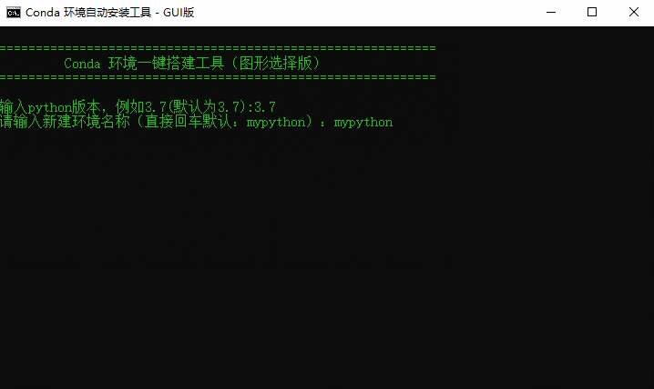
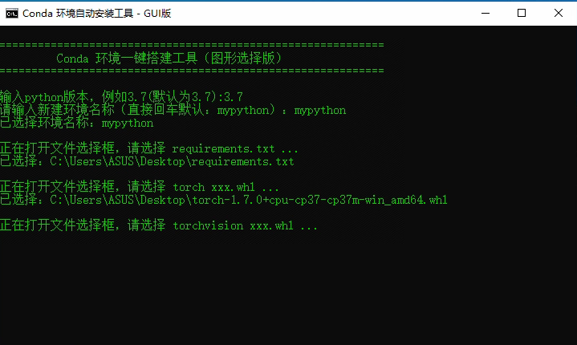
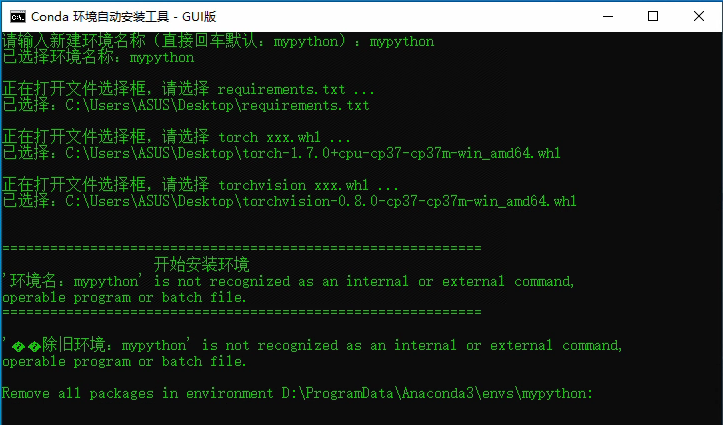
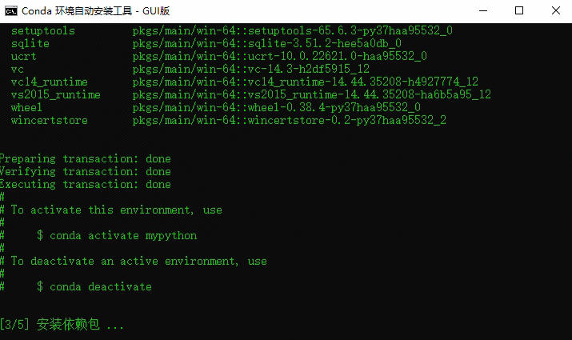
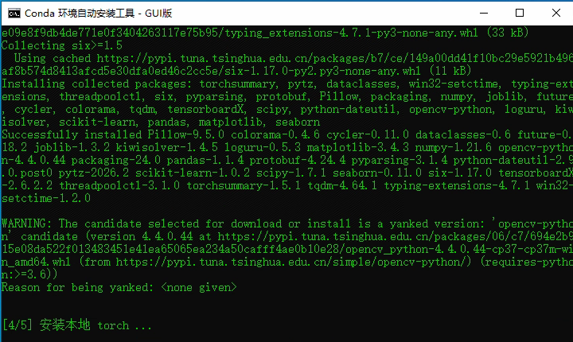
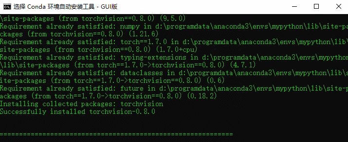

# 一键式pytorch安装脚本工具
## **说明**

本安装脚本是在windows环境下运行的，linux环境下无法运行！！

在安装pytorch之前，需保证已经安装**Anaconda**，且Anaconda**已配置环境变量！！**

:star: 如何检验Anaconda是否添加环境变量：在cmd中(不是Anaconda Prompt)，输入conda 后按“回车”，如果**没有提示**“conda不是内外部命令”这类错误，就说明系统中已有conda的环境变量，就可以继续下面的步骤了。

## 安装步骤

百度网盘：

链接: https://pan.baidu.com/s/10juM86p0Qx-KeiSxO8BBww 提取码: yypn 

下载百度网盘中的requirements.txt、pytorch至本地。

这里我提供了一些torch离线安装包：pytorch 1.7.0-gpu-python3.7、pytorch 1.7.0-cpu-python3.7、pytorch 1.12.1-gpu-python3.8版。

如果需要其他torch和torchvision的离线包，可以从以下网址找：

torch:https://download.pytorch.org/whl/torch/

torchvision:https://download.pytorch.org/whl/torchvision/

:star: torch和torchvision对应版本关系为：torch的版本+1及为torchvision版本，例如torch 1.7.0对应的torchvision 0.8.0

------

**准备好上述内容后，即可正式开始安装！~**

我这里以装pytorch 1.7.0 cpu python3.7为例！

**步骤1：双击torch install GUI V2.bat**

**步骤2：输入python版本和虚拟环境名字**

输入python版本(例如3.7，**一定要和torch的python版本对应**)，输入虚拟环境名称(如mypython)

**步骤3：选择requirements.txt、torch和torchvision的离线安装包(whl文件)。**

这里选择下载的文件。顺序不可乱！(保持网络通畅，requirements.txt的安装需要网络)

**开发不易，如能帮到你，打赏我一下，喝杯奶茶~**

**等待安装即可**，安装部分过程如下：

